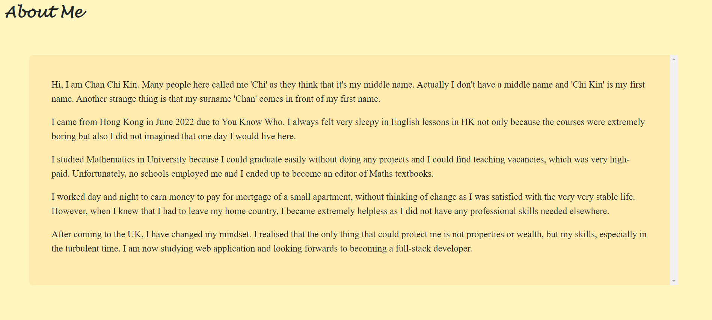

# 20 React: React Portfolio

## Your Task

I create a portfolio web page using React. It’ll be a place not only to share your projects but also to share your work with other developers and collaborate on projects.

## Functionalities

- When I load the portfolio, then I am presented with a page containing a header, a section for content, and a footer
- When I view the header, then I am presented with the developer's name and navigation with titles corresponding to different sections of the portfolio
- When I view the navigation titles, then I am presented with the titles About Me, Portfolio, Contact, and Resume, and the title corresponding to the current section is highlighted
- When I click on a navigation title, then I am presented with the corresponding section below the navigation without the page reloading and that title is highlighted
- When I load the portfolio the first time, then the About Me title and section are selected by default
- When I am presented with the About Me section, then I see a recent photo or avatar of the developer and a short bio about them
- When I am presented with the Portfolio section, then I see titled images of six of the developer’s applications with links to both the deployed applications and the corresponding GitHub repositories
- When I am presented with the Contact section, then I see a contact form with fields for a name, an email address, and a message
- When I move my cursor out of one of the form fields without entering text, then I receive a notification that this field is required
- When I enter text into the email address field, then I receive a notification if I have entered an invalid email address
- When I am presented with the Resume section, then I see a link to a downloadable resume and a list of the developer’s proficiencies
- When I view the footer, then I am presented with text or icon links to the developer’s GitHub and LinkedIn profiles, and their profile on a third platform (Stack Overflow, Twitter)

## Structure

- A single `Navbar` component which serves as the header that appears on multiple pages, and contains buttons that conditionally render the different sections of your portfolio

- A single `PageContainer` component that will contain the page rendered by the Navbar.

  - A single `About` page that show my story.
  - A single `Portfolio` page that show the projects that I have made and love the most.
  - A single `Contact` page for guests to leave their contact details.
  - A single `Resume` page to show my working experience and a link to download my resume.

- A single `Footer` component that appears on multiple pages and contain links to my Github page and LinkedIn page.

## Screenshot

- `Navbar` contains buttons for navigating to different pages. The title on the left can also be clicked to go to `About`.\
  
- `About` contains my story. One can scroll up and down to read.\
  
- `Portfolio` contains six of my favourite projects. One can click on each project card to link to its github repository.\
  
- `Contact` contains fields to input contact details. Warning messages will show until the criterias are met.\
  
- `Resume` show my working experience to let guest to know me more. A link is there to download a pdf.\
  
- `Footer` contains icons to link to my GitHub and LinkedIn respectively.\
  

## Extra

- There are also responsiveness feature for the page. When the width of the page shrinks, `Menu` is shown on the right of the `Navbar`. When clicking on the `Navbar`, the buttons appear again.\
  

## Deployment

- github: [Link](https://cckinwest.github.io/Week20-React-Portfolio/)
